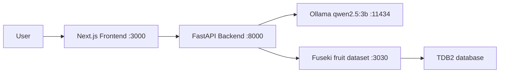

# Ontology Knowledge Graph

ระบบถามตอบเกี่ยวกับ Fruit Ontology โดยใช้ natural language, Ollama, Apache Jena Fuseki และ FastAPI พร้อมหน้าเว็บ Next.js

ผู้ใช้ส่งคำถามจาก frontend ระบบจะให้ LLM สร้าง SPARQL แบบ read-only, ตรวจสอบ query, ดึงข้อมูลจาก knowledge graph และให้ LLM สรุปผลเป็นคำตอบสั้น ๆ

## Architecture



## โครงสร้างโปรเจกต์

```text
Ontology/
├── frontend/       # Web UI และ API client
├── backend/        # FastAPI, LLM pipeline และ SPARQL validation
└── fruit-kg/       # Fuseki configuration และ fruit TDB2 database
```

อ่านรายละเอียดเฉพาะส่วนได้ที่:

- [Frontend README](frontend/README.md)
- [Backend README](backend/README.md)
- [Fruit Knowledge Graph README](fruit-kg/README.md)

แต่ละ conversation และข้อความสนทนาถูกเก็บใน SQLite ของ backend เพื่อให้เปิดดูประวัติย้อนหลังได้จาก Sidebar

## สิ่งที่ต้องมี

- Node.js 18.18 ขึ้นไป
- Python 3.9 ขึ้นไป
- Ollama และโมเดล `qwen2.5:3b`
- Docker และ Docker Compose

## Quick start

เปิด terminal แยกกัน 3 หน้าต่าง

### 1. เริ่ม Fuseki

```bash
cd fruit-kg
cp .env.example .env
# แนะนำให้เปลี่ยน FUSEKI_ADMIN_PASSWORD ใน .env

docker compose up -d
```

ตรวจสอบ:

```bash
curl http://localhost:3030/$/ping
```

### 2. เริ่ม backend

```bash
cd backend
python3 -m venv .venv
source .venv/bin/activate
pip install -r requirements.txt
cp .env.example .env
python3 run.py
```

Backend เปิดที่ `http://localhost:8000`

ตรวจสอบ:

```bash
curl http://localhost:8000/health
```

### 3. เริ่ม frontend

```bash
cd frontend
npm install
npm run dev
```

เปิดหน้าเว็บที่ `http://localhost:3000`

## Configuration

### Backend

ไฟล์ `backend/.env`:

```env
OLLAMA_URL=http://localhost:11434
OLLAMA_MODEL=qwen2.5:3b
FUSEKI_URL=http://localhost:3030
FUSEKI_DATASET=fruit
ONTOLOGY_NAMESPACE=http://example.org/fruit-ontology#
```

### Frontend

ค่าเริ่มต้น frontend เรียก backend ที่ `http://localhost:8000` หากต้องการเปลี่ยน ให้สร้าง `frontend/.env.local`:

```env
NEXT_PUBLIC_BACKEND_URL=http://localhost:8000
```

หลังแก้ environment ต้อง restart service ที่เกี่ยวข้อง

## API example

```bash
curl -X POST http://localhost:8000/api/chat \
  -H 'Content-Type: application/json' \
  -d '{"message":"What is the sweetness of Banana?"}'
```

ตัวอย่างผลลัพธ์:

```json
{
  "question": "What is the sweetness of Banana?",
  "generated_sparql": "PREFIX : <http://example.org/fruit-ontology#> SELECT ...",
  "results": [{"sweetness": "7"}],
  "answer": "The sweetness of Banana is 7.",
  "metadata": {"model": "qwen2.5:3b", "execution_time_ms": 12000}
}
```

ดูรายการแชทและข้อความย้อนหลัง:

```bash
curl 'http://localhost:8000/api/chats?limit=20'
curl 'http://localhost:8000/api/chats/1'
```

## คำถามตัวอย่าง

- `Which fruits are yellow?`
- `What is the sweetness of Banana?`
- `Which fruits are grown in Thailand?`
- `What color is Mango?`

## Testing

Backend tests ใช้ mock สำหรับ Ollama และ Fuseki:

```bash
cd backend
PYTHONPATH=. python3 -m pytest -q
```

Frontend production build:

```bash
cd frontend
npm run build
```

## Security notes

- Backend อนุญาตเฉพาะ SPARQL `SELECT`
- Query ที่เป็น update operation จะถูกปฏิเสธ
- URI และ ontology terms ต้องอยู่ใน vocabulary ที่กำหนด
- ผลลัพธ์จาก Fuseki จะถูกส่งให้ LLM สรุปเท่านั้น
- ไม่ควร commit ไฟล์ `.env` หรือ password จริง
- ห้ามลบ `fruit-kg/data/databases/fruit` เพราะเป็นฐานข้อมูล TDB2

## Troubleshooting

### Port ถูกใช้งานอยู่

เปลี่ยน `APP_PORT` ใน `backend/.env` หรือหยุด process เดิมก่อนเริ่ม backend

### Ollama ไม่ตอบสนอง

```bash
ollama list
curl http://localhost:11434/api/tags
```

### Frontend ติดต่อ backend ไม่ได้

ตรวจว่า backend ทำงานอยู่ที่ port 8000 และ frontend origin อยู่ใน `CORS_ORIGINS`

### Fuseki dataset ไม่พบ

ตรวจว่า container ทำงานอยู่และใช้ URL:

```text
http://localhost:3030/fruit/query
```
