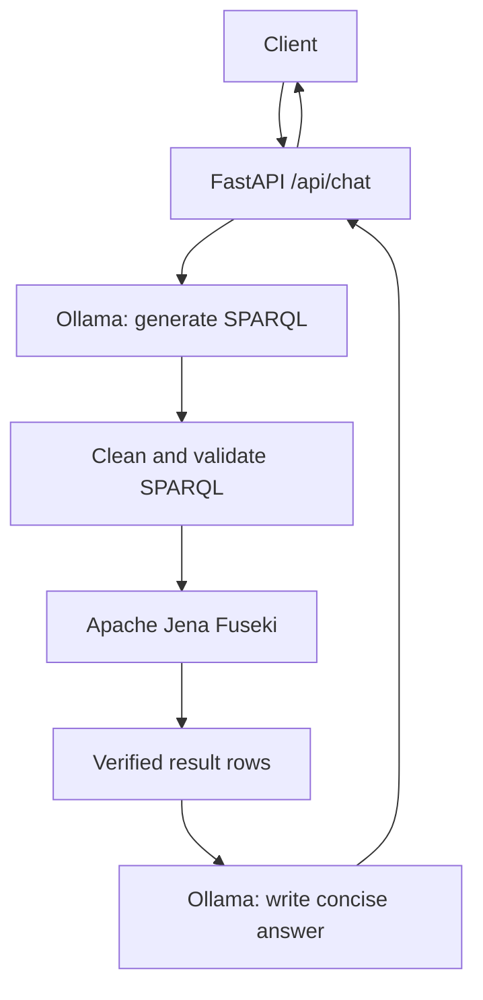
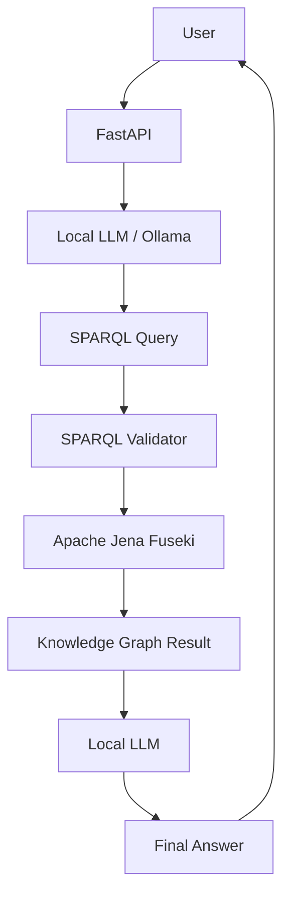

# Ontology Knowledge Graph Backend

FastAPI backend สำหรับแปลงคำถามภาษาธรรมชาติเป็น SPARQL แบบ read-only, query ข้อมูลจาก Apache Jena Fuseki และใช้ Ollama สรุปผลเป็นคำตอบที่อ่านง่าย

## ภาพรวมการทำงาน



ลำดับสำคัญใน `ChatService.answer()` คือ:

1. สร้าง prompt สำหรับ SPARQL
2. ขอ query จาก Ollama และทำความสะอาด output
3. ตรวจว่าเป็น `SELECT` และใช้ vocabulary ที่อนุญาต
4. retry การสร้าง query ได้อีกหนึ่งครั้งถ้า validation ไม่ผ่าน
5. ส่ง query ที่ผ่านการตรวจไปยัง Fuseki
6. ส่งผลลัพธ์จาก Fuseki เป็น JSON ให้ Ollama สร้างคำตอบ
7. ตัด reasoning หรือ meta-commentary ก่อนส่ง response กลับ client

## โครงสร้างไฟล์

```text
backend/
├── app/
│   ├── main.py                    # สร้าง FastAPI app และ dependency services
│   ├── api/chat.py                # HTTP endpoint และ error mapping
│   ├── core/config.py              # อ่าน environment settings
│   ├── models/chat.py              # Request/response schemas
│   ├── prompts/
│   │   ├── ontology_context.py    # Ontology vocabulary ที่ LLM ใช้ได้
│   │   ├── sparql_prompt.py        # Prompt สำหรับสร้าง query
│   │   └── answer_prompt.py        # Prompt สำหรับสรุปผล query
│   ├── services/
│   │   ├── chat_service.py        # Orchestrates ทั้ง pipeline
│   │   ├── fuseki_service.py      # เรียก Fuseki และ normalize bindings
│   │   ├── llm_service.py         # เรียก Ollama
│   │   └── sparql_validator.py    # ตรวจความปลอดภัยและ vocabulary
│   └── utils/sparql_parser.py     # ดึง query จาก LLM output
├── tests/                         # Unit tests ที่ mock external services
├── .env.example                   # ตัวอย่าง configuration
├── data/chat.db                   # SQLite conversations/messages (สร้างอัตโนมัติ, ไม่ควร commit)
├── requirements.txt
└── run.py                         # จุดเริ่มต้นสำหรับ Uvicorn
```

## สิ่งที่ต้องมี

- Python 3.9 ขึ้นไป
- Ollama ที่กำลังทำงานอยู่
- โมเดล Ollama เช่น `qwen2.5:3b`
- Apache Jena Fuseki ที่มี dataset `fruit`

ใน repository นี้มี Fuseki setup อยู่ที่ `../fruit-kg`

## ติดตั้ง

```bash
cd backend
python3 -m venv .venv
source .venv/bin/activate
pip install -r requirements.txt
cp .env.example .env
```

ตั้งค่าโมเดลใน `.env`:

```env
OLLAMA_URL=http://localhost:11434
OLLAMA_MODEL=qwen2.5:3b
FUSEKI_URL=http://localhost:3030
FUSEKI_DATASET=fruit
ONTOLOGY_NAMESPACE=http://example.org/fruit-ontology#
CHAT_DATABASE_PATH=data/chat.db
```

## เริ่ม services

เริ่ม Ollama และตรวจสอบโมเดล:

```bash
ollama serve
ollama list
ollama pull qwen2.5:3b
```

เริ่ม Fuseki:

```bash
cd fruit-kg
docker compose up -d
```

ตรวจสอบ Fuseki:

```bash
curl http://localhost:3030/fruit/query \
    -H 'Accept: application/sparql-results+json' \
    --data-urlencode 'query=SELECT * WHERE { ?s ?p ?o } LIMIT 1'
```

## เริ่ม backend

ต้องรันจากโฟลเดอร์ `backend` เพื่อให้ import `app` ถูกต้อง:

```bash
cd backend
python3 run.py
```

API จะเปิดที่ `http://localhost:8000`

## API

### Health check

```http
GET /health
```

Response:

```json
{"status":"ok"}
```

### Chat

```http
POST /api/chat
Content-Type: application/json
```

Request:

```json
{"message":"What is the sweetness of Banana?"}
```

Response ประกอบด้วย:

- `question`: คำถามเดิม
- `generated_sparql`: query ที่ผ่าน validation
- `results`: rows จริงจาก Fuseki
- `answer`: คำตอบจากผลลัพธ์ที่ผ่านการตรวจ
- `metadata`: model และ execution time

### Recent chat history

```http
GET /api/chats?limit=20
```

คืนประวัติ chat ล่าสุดเรียงจากใหม่ไปเก่า โดย `limit` รับค่าระหว่าง 1 ถึง 100

ข้อมูลถูกเก็บใน SQLite ที่ `CHAT_DATABASE_PATH` และสร้างตาราง `conversations` กับ `messages` อัตโนมัติเมื่อ backend เริ่มทำงาน

เมื่อไม่ส่ง `conversation_id` ใน `POST /api/chat` ระบบจะสร้างแชทใหม่และคืน id กลับมา การถามต่อในแชทเดิมให้ส่ง id เดิมกลับมา:

```json
{"message":"What color is it?","conversation_id":1}
```

ใช้ `GET /api/chats/{conversation_id}` เพื่อโหลด messages ทั้งหมดของแชทนั้น

ตัวอย่าง response:

```json
{
    "question": "What is the sweetness of Banana?",
    "generated_sparql": "PREFIX : <http://example.org/fruit-ontology#> SELECT ...",
    "results": [{"sweetness": "7"}],
    "answer": "The sweetness of Banana is 7.",
    "metadata": {"model": "qwen2.5:3b", "execution_time_ms": 12000}
}
```

## Security และ validation

- รับเฉพาะ SPARQL `SELECT`
- ปฏิเสธ update operations เช่น `INSERT`, `DELETE`, `DROP` และ `CLEAR`
- ปฏิเสธ URI นอก ontology namespace
- ตรวจ ontology terms กับ vocabulary ที่กำหนด
- ไม่ส่ง query ไป Fuseki จนกว่าจะผ่าน parser และ validator
- ส่งผลลัพธ์ที่ verified แล้วเท่านั้นให้ answer prompt
- จำกัดคำตอบเป็นหนึ่งประโยคไม่เกิน 20 คำ

## ทดสอบ

การทดสอบไม่ต้องเปิด Ollama หรือ Fuseki เพราะ external services ถูก mock:

```bash
cd backend
PYTHONPATH=. python3 -m pytest -q
```

ชุดทดสอบครอบคลุม health endpoint, request validation, SPARQL parsing, query security, retry, external service errors และการสร้างคำตอบจากผลลัพธ์จริง

## แก้ปัญหาเบื้องต้น

### `OLLAMA_MODEL is not configured`

ตรวจ `.env` ว่ามีค่า model และ restart backend:

```env
OLLAMA_MODEL=qwen2.5:3b
```

### `The LLM generated an invalid SPARQL query`

ระบบจะ retry ให้อัตโนมัติหนึ่งครั้ง หากยังไม่ผ่านให้ตรวจ log ของ backend และ ontology vocabulary ใน `app/prompts/ontology_context.py`

### `Ollama request failed`

ตรวจว่า Ollama ทำงานและ URL ถูกต้อง:

```bash
curl http://localhost:11434/api/tags
```

### port ถูกใช้งานอยู่

เปลี่ยนค่าใน `.env` เช่น:

```env
APP_PORT=8001
```
# Ontology Knowledge Graph Chat Backend

This backend translates natural-language questions into read-only SPARQL queries, executes them against Apache Jena Fuseki, and turns the verified result into a concise answer using Ollama. The pipeline is deterministic and does not use agents, LangChain, LangGraph, or tool loops.

## Architecture



## Prerequisites

- Python 3.11 or newer is recommended.
- Ollama with a local model.
- Apache Jena Fuseki serving the configured dataset.

The current repository includes a Fruit Fuseki setup in `../fruit-kg`. The backend defaults to the Fruit ontology context, but its namespace, dataset, endpoints, and model are environment-configurable.

## Install and configure

```bash
cd backend
python3 -m venv .venv
source .venv/bin/activate
pip install -r requirements.txt
cp .env.example .env
```

Set `OLLAMA_MODEL` in `.env`; the model is intentionally not hard-coded. Important settings are `OLLAMA_URL`, `FUSEKI_URL`, `FUSEKI_DATASET`, `ONTOLOGY_NAMESPACE`, `LLM_TIMEOUT`, `FUSEKI_TIMEOUT`, and `CORS_ORIGINS`.

## Run dependencies

Start Ollama and pull a model, for example:

```bash
ollama serve
ollama pull qwen3:4b
```

Start the included Fuseki service from the repository root:

```bash
cd fruit-kg
docker compose up -d
```

## Start the API

```bash
cd backend
python run.py
```

The API listens on `http://localhost:8000` by default.

## API

`GET /health` returns:

```json
{"status":"ok"}
```

`POST /api/chat` accepts:

```json
{"message":"Which fruits are grown in Thailand and have a yellow color?"}
```

The response includes the original question, generated SPARQL, normalized result bindings, final answer, configured model, and execution time.

## Security and grounding

The user message is untrusted prompt content. The schema prompt is authoritative, generated queries are cleaned and parsed, only SELECT queries are allowed, update operations are rejected, and ontology terms outside the configured vocabulary are rejected. Fuseki is never called for an invalid query. The final answer receives only the verified result and explicitly handles empty results.

## Testing

External services are mocked in the unit tests:

```bash
cd backend
PYTHONPATH=. python -m pytest -q
```

The test suite covers health, request validation, successful chat responses, invalid generated queries, SPARQL update rejection, and ontology vocabulary validation. Live Ollama and Fuseki checks require those services to be running and correctly populated.