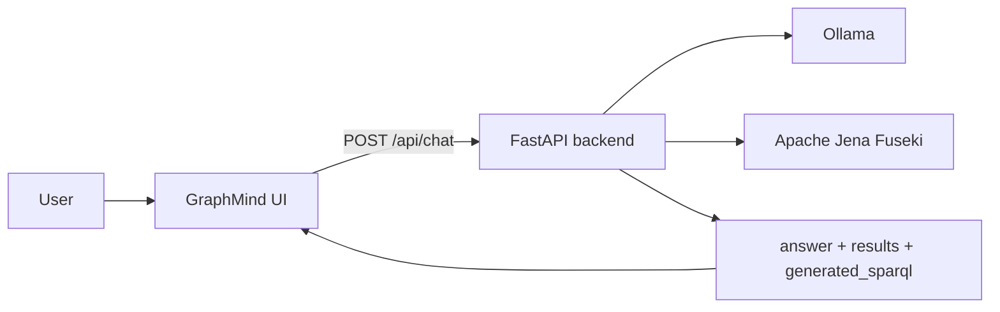

# GraphMind Frontend

Next.js frontend สำหรับถามข้อมูลจาก Fruit Knowledge Graph ผ่าน backend API โดยตรง หน้าเว็บไม่มี mock conversation หรือ mock query data

## การทำงาน



เมื่อผู้ใช้ส่งคำถาม `chatWithBackend()` จะส่ง request ไปยัง backend และ map response เป็นข้อความ assistant โดย:

- `answer` แสดงเป็นคำตอบหลัก
- `results` แสดงใน Knowledge Graph Evidence
- `generated_sparql` แสดงใน View SPARQL Query
- error จาก backend แสดงใน chat แทนการทำให้หน้าเว็บ crash

ประวัติแชทโหลดจาก `GET /api/chats` เมื่อเปิดหน้าเว็บ การเลือก conversation จะเรียก `GET /api/chats/{id}` และการถามต่อจะส่ง `conversation_id` เดิมกลับไปยัง backend ส่วน New Chat จะ reset id เพื่อเริ่ม conversation ใหม่

## โครงสร้างไฟล์

```text
frontend/
├── app/
│   ├── page.tsx          # หน้าแรก
│   ├── layout.tsx        # metadata และ global layout
│   └── globals.css       # design tokens และ global styles
├── components/
│   └── graphmind-app.tsx # UI และ chat interaction
├── lib/
│   ├── graphmind-data.ts # types, API client และคำถามแนะนำ
│   └── utils.ts          # utility สำหรับ class names
├── public/               # icons ที่ใช้จริง
├── package.json
└── next.config.mjs
```

## สิ่งที่ต้องมี

- Node.js 18.18 ขึ้นไป
- npm หรือ pnpm
- backend ที่ทำงานอยู่บน `http://localhost:8000`

## ติดตั้งและรัน

```bash
cd frontend
npm install
npm run dev
```

เปิด http://localhost:3000

ก่อนใช้งาน chat ต้องเปิด backend:

```bash
cd backend
python3 run.py
```

## ตั้งค่า backend URL

ค่าเริ่มต้นของ frontend คือ:

```text
http://localhost:8000
```

หาก backend อยู่คนละ host หรือ port ให้สร้าง `frontend/.env.local`:

```env
NEXT_PUBLIC_BACKEND_URL=http://localhost:8000
```

หลังเปลี่ยน environment ต้อง restart Next.js development server

## API contract

Frontend เรียก:

```http
POST /api/chat
Content-Type: application/json
```

Request:

```json
{"message":"What is the sweetness of Banana?"}
```

Response ที่ frontend ใช้:

```json
{
  "answer": "The sweetness of Banana is 7.",
  "results": [{"sweetness": "7"}],
  "generated_sparql": "PREFIX : <http://example.org/fruit-ontology#> SELECT ..."
}
```

Backend ต้องเปิด CORS ให้ origin ของ frontend เช่น `http://localhost:3000`

## คำถามตัวอย่าง

- `Which fruits are yellow?`
- `What is the sweetness of Banana?`
- `Which fruits are grown in Thailand?`
- `What color is Mango?`

คำถามแนะนำในหน้าแรกเป็นเพียง shortcut สำหรับคำถามที่อยู่ใน fruit ontology ไม่ใช่ข้อมูลผลลัพธ์ที่ hardcode

## ตรวจสอบคุณภาพ

Production build:

```bash
npm run build
```

ตรวจ TypeScript errors ด้วย build ของ Next.js โดยตรง โปรเจกต์ตั้งค่า `next.config.mjs` ให้ build ผ่านโดยไม่หยุดที่ type errors เดิม ดังนั้นควรตรวจ diagnostics ใน VS Code ร่วมด้วย

## หมายเหตุการพัฒนา

- ไม่ควรนำ mock response กลับมาไว้ใน `lib/graphmind-data.ts`
- ข้อมูลที่แสดงใน Evidence ต้องมาจาก `response.results`
- หากเพิ่ม field ใน backend response ให้ปรับ type และ mapping ใน `chatWithBackend()` พร้อมกัน
- Graph panel จะไม่แสดงจนกว่าจะมี graph node data จริงจาก backend# Ontology

This is a [Next.js](https://nextjs.org) project bootstrapped with [v0](https://v0.app).

## Built with v0

This repository is linked to a [v0](https://v0.app) project. You can continue developing by visiting the link below -- start new chats to make changes, and v0 will push commits directly to this repo. Every merge to `main` will automatically deploy.

[Continue working on v0 →](https://v0.app/chat/projects/prj_A8PiufxrKPgUFx3vn4Emr9EUDGUQ)

## Getting Started

First, run the development server:

```bash
npm run dev
# or
yarn dev
# or
pnpm dev
```

Open [http://localhost:3000](http://localhost:3000) with your browser to see the result.

You can start editing the page by modifying `app/page.tsx`. The page auto-updates as you edit the file.

## Learn More

To learn more, take a look at the following resources:

- [Next.js Documentation](https://nextjs.org/docs) - learn about Next.js features and API.
- [Learn Next.js](https://nextjs.org/learn) - an interactive Next.js tutorial.
- [v0 Documentation](https://v0.app/docs) - learn about v0 and how to use it.
