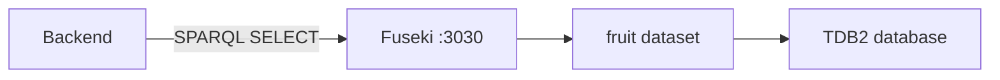

# Fruit Knowledge Graph

Apache Jena Fuseki setup สำหรับ fruit ontology ของโปรเจกต์ Ontology ใช้ TDB2 เป็น storage และเปิด SPARQL endpoint ให้ backend เรียกข้อมูลที่ `http://localhost:3030/fruit/query`

## ภาพรวม



โฟลเดอร์นี้มีเฉพาะ infrastructure และ data ของ knowledge graph ไม่มี application code แยกต่างหาก

## โครงสร้าง

```text
fruit-kg/
├── docker-compose.yml              # เริ่ม Fuseki และ mount data volume
├── .env.example                    # ตัวอย่าง environment สำหรับ admin password
├── README.md
└── data/
    ├── config.ttl                  # Fuseki server configuration
    ├── shiro.ini                   # Authentication และ route permissions
    ├── configuration/fruit.ttl     # Dataset และ endpoint configuration
    └── databases/fruit/            # TDB2 persistent database; ห้ามลบ
```

โฟลเดอร์ `data/logs`, `data/backups`, `data/system` และ `data/system_files` เป็น runtime files ที่ Fuseki อาจสร้างขึ้นเอง ไม่ใช่ source configuration ส่วน `data/templates` เป็นไฟล์ template ของ Fuseki ที่ image อาจสร้างไว้และไม่เกี่ยวกับ dataset fruit

## สิ่งที่ต้องมี

- Docker และ Docker Compose
- port `3030` ว่าง
- backend ที่ตั้งค่า `FUSEKI_URL=http://localhost:3030` และ `FUSEKI_DATASET=fruit`

## ตั้งค่า

คัดลอกไฟล์ environment template:

```bash
cp .env.example .env
```

กำหนดรหัสผ่าน admin ใน `.env`:

```env
FUSEKI_ADMIN_PASSWORD=เปลี่ยนเป็นรหัสผ่านของคุณ
```

หากไม่ได้ตั้งค่า ค่าเริ่มต้นของ Compose คือ `admin` สำหรับ development เท่านั้น

## เริ่ม Fuseki

```bash
docker compose up -d
```

ตรวจสอบ container:

```bash
docker compose ps
```

หยุด service:

```bash
docker compose down
```

คำสั่ง `docker compose down` ไม่ลบ database เพราะ database อยู่ใน bind-mounted `data/` หากต้องการลบข้อมูลจริง ต้องดำเนินการอย่างระมัดระวังและทำ backup ก่อน

## Endpoint

Dataset ชื่อ `fruit` มี endpoint หลัก:

| Endpoint | Operation | ใช้งาน |
| --- | --- | --- |
| `/fruit/query` | SPARQL query | ใช้โดย backend |
| `/fruit/update` | SPARQL update | admin/development เท่านั้น |
| `/fruit/data` | Graph Store Protocol read/write | admin/development เท่านั้น |
| `/fruit/get` | Graph Store Protocol read | อ่าน graph |

ตัวอย่าง query:

```bash
curl http://localhost:3030/fruit/query \
  -H 'Accept: application/sparql-results+json' \
  --data-urlencode 'query=SELECT * WHERE { ?s ?p ?o } LIMIT 10'
```

ตัวอย่าง query ตาม ontology:

```sparql
PREFIX : <http://example.org/fruit-ontology#>

SELECT ?fruitName
WHERE {
  ?fruit :hasColor :Yellow .
  ?fruit :name ?fruitName .
}
```

## เชื่อมกับ backend

ใน `backend/.env` ใช้ค่า:

```env
FUSEKI_URL=http://localhost:3030
FUSEKI_DATASET=fruit
ONTOLOGY_NAMESPACE=http://example.org/fruit-ontology#
```

จากนั้นเริ่ม service ตามลำดับ:

```bash
# terminal 1
cd fruit-kg
docker compose up -d

# terminal 2
cd backend
python3 run.py
```

Backend จะส่งเฉพาะ query `SELECT` ที่ผ่าน validator ไปยัง `/fruit/query`

## Configuration files

### `docker-compose.yml`

กำหนด image `stain/jena-fuseki`, port, admin password และ memory limit ของ JVM โดย mount `./data` ไปที่ `/fuseki` ใน container

### `data/configuration/fruit.ttl`

กำหนด TDB2 location และชื่อ dataset `fruit` รวมถึง endpoint ที่เปิดใช้งาน

### `data/config.ttl`

เป็น server configuration ขั้นต่ำของ Fuseki ไม่มี custom server setting

### `data/shiro.ini`

กำหนด authentication ของ Fuseki: status/ping เปิดให้ตรวจสอบได้, update routes ต้องใช้ admin และ query เปิดให้ backend เรียกได้

## การดูแลข้อมูล

- ห้ามลบหรือแก้ไฟล์ภายใต้ `data/databases/fruit/` ขณะ container กำลังทำงาน
- ใช้ `docker compose down` ก่อนย้ายหรือ backup database
- อย่า commit password จริงใน `.env`
- อย่าใช้ password ค่าเริ่มต้นใน production
- ลบ runtime folders ได้เฉพาะเมื่อ container หยุดและเข้าใจผลกระทบแล้ว

## Troubleshooting

### `Connection refused`

ตรวจว่า container ทำงานและ port ถูก publish:

```bash
docker compose ps
curl http://localhost:3030/$/ping
```

### Dataset ไม่พบ

ตรวจว่า URL ใช้ชื่อ dataset ถูกต้อง:

```text
http://localhost:3030/fruit/query
```

และตรวจว่า `data/configuration/fruit.ttl` มี `fuseki:name "fruit"`

### Query ถูกปฏิเสธ

การแก้ไขข้อมูลผ่าน `/update` ไม่ใช่ flow ของ backend ปกติ Backend อนุญาตเฉพาะ read-only `SELECT` และตรวจ ontology namespace ก่อน query
